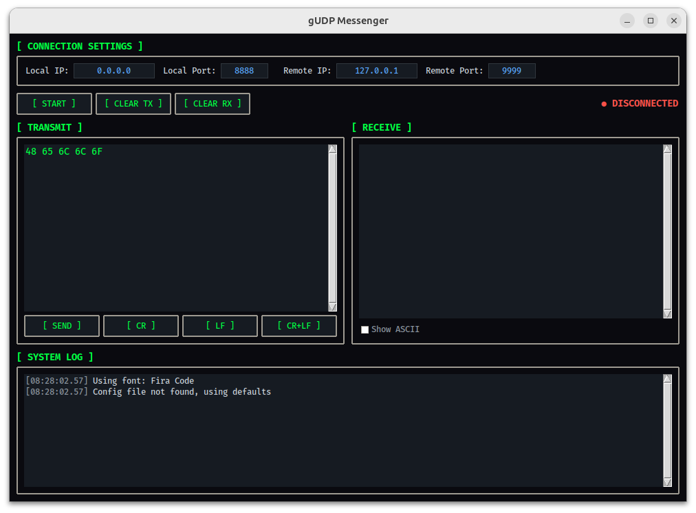

# GUdpMessenger

A simple UDP Hexadecimal Messenger Application for sending and receiving hexadecimal data over UDP networks.

## Features

- **Hexadecimal Data Transfer**: Send and receive raw hexadecimal data via UDP protocol
- **Dual-Pane Interface**: Separate panels for transmit (TX) and receive (RX) data
- **ASCII Display**: Optional ASCII representation alongside hex output for better readability
- **Connection Management**: Configure local and remote IP addresses and ports
- **Real-time Logging**: System log with color-coded messages for tracking activity
- **File Operations**: Load and save hexadecimal data from/to text files
- **Dark Theme**: Modern dark industrial interface with matrix-green accents
- **Cross-Platform**: Works on Linux, macOS, and Windows with adaptive font selection
- **Configuration Persistence**: Automatically saves and restores connection settings



## Requirements

- Python 3.6 or higher
- Standard library modules (no external dependencies required):
  - `tkinter` (GUI framework)
  - `socket` (network communication)
  - `threading` (background listening)
  - `json` (configuration storage)

## Installation

1. Clone or download the repository:
```bash
git clone <repository-url>
cd GUdpMessenger
```

2. Ensure Python 3 is installed:
```bash
python3 --version
```

3. No additional installation required - all dependencies are part of the Python standard library.

## Usage

### Running the Application

```bash
python3 gudp_messenger.py
```

Or on Windows:
```bash
python gudp_messenger.py
```

### Basic Operation

1. **Configure Connection**:
   - Set Local IP and Port (default: 0.0.0.0:8888)
   - Set Remote IP and Port (default: 127.0.0.1:9999)

2. **Start Listening**:
   - Click `[ START ]` to begin listening on the local port
   - Status will change to "● LISTENING"

3. **Send Data**:
   - Enter hexadecimal data in the TRANSMIT panel
   - Valid characters: 0-9, A-F (case-insensitive)
   - Click `[ SEND ]` to transmit data
   - Use `[ CR ]`, `[ LF ]`, or `[ CR+LF ]` buttons to insert special characters

4. **Receive Data**:
   - Incoming data appears in the RECEIVE panel
   - Toggle "Show ASCII" checkbox to display ASCII representation
   - Source address is shown for each received packet

5. **Clear Panels**:
   - `[ CLEAR TX ]` clears the transmit panel
   - `[ CLEAR RX ]` clears the receive panel

6. **File Operations**:
   - Right-click in the transmit panel to open context menu
   - Select "Open File" to load hexadecimal data from a file
   - Select "Save File" to save current transmit data to a file

7. **Stop Listening**:
   - Click `[ STOP ]` to stop the UDP listener
   - Status will change to "● DISCONNECTED"

### Configuration

Connection settings are automatically saved to `gudp_messenger.json` in the same directory as the script. Settings are loaded on startup and saved when closing the application.

Configuration file format:
```json
{
  "connection": {
    "local_ip": "0.0.0.0",
    "local_port": 8888,
    "remote_ip": "127.0.0.1",
    "remote_port": 9999
  }
}
```

## Data Format

### Hexadecimal Input
- Enter hex values separated by spaces or newlines
- Example: `48 65 6C 6C 6F` (represents "Hello")
- Case-insensitive: `48 65 6c 6c 6f` is also valid

### Special Characters
- `[ CR ]` inserts `0D` (Carriage Return)
- `[ LF ]` inserts `0A` (Line Feed)
- `[ CR+LF ]` inserts `0D 0A`

### Output Format
- **Hex mode**: `48 65 6C 6C 6F`
- **ASCII mode**: `48 65 6C 6C 6F  [Hello]` (non-printable characters shown as `.`)

## Network Notes

- UDP is connectionless - data may be lost without notification
- Ensure firewall rules allow UDP traffic on the specified ports
- Use `0.0.0.0` as local IP to listen on all available network interfaces
- Maximum packet size: 65535 bytes (UDP limit)

## Troubleshooting

### "Socket not bound" Error
- Ensure you click `[ START ]` before attempting to send data
- Check that the local port is not already in use by another application

### "Invalid hexadecimal data" Error
- Verify that data contains only valid hex characters (0-9, A-F)
- Remove any non-hex characters or spaces if validation fails

### No Data Received
- Verify remote IP and port are correct
- Check firewall settings
- Ensure the remote application is sending to the correct local IP and port
- Test with loopback (127.0.0.1) for local testing

## Font Support

The application automatically selects the best available monospace font based on your operating system:

**Linux**: JetBrains Mono, Fira Code, Cascadia Code, DejaVu Sans Mono, Ubuntu Mono, Liberation Mono, Noto Mono, Courier New

**macOS**: SF Mono, Menlo, Monaco, JetBrains Mono, Fira Code, Courier New

**Windows**: Cascadia Code, Consolas, Courier New

## License

This project is provided as-is for educational and personal use.

## Author

Gino Bogo
